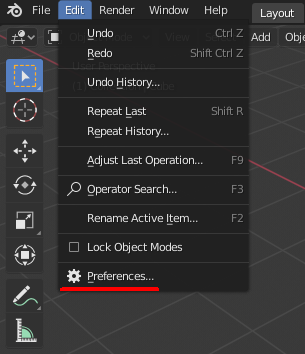
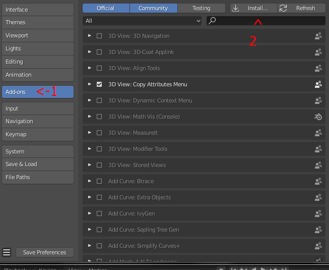
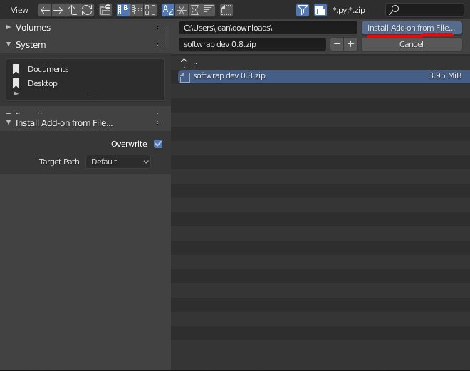
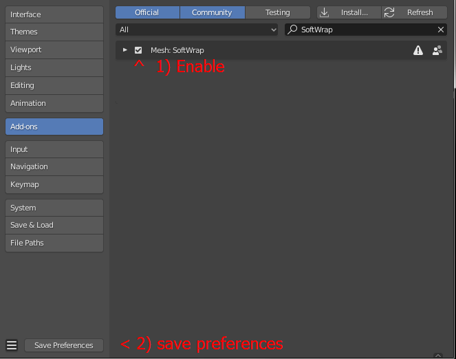
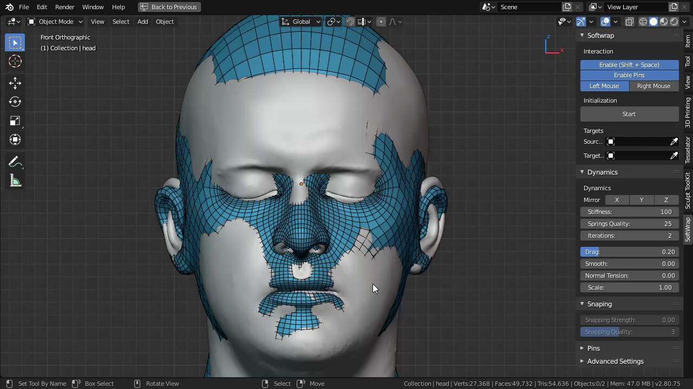
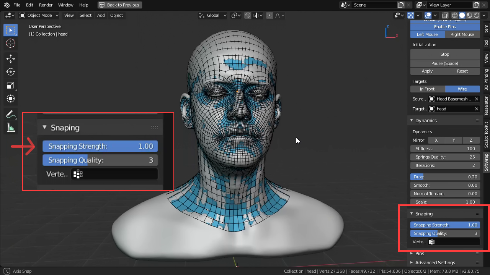
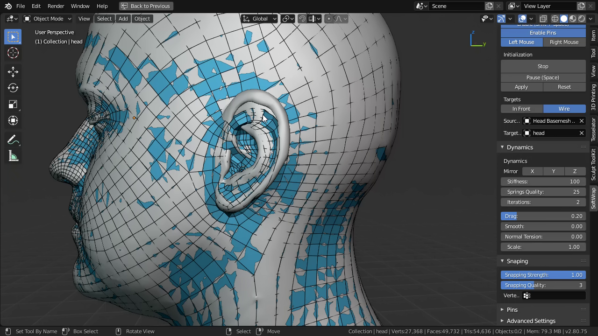

## Welcome to the Softwrap-Manual

Welcome to this unfinished page, this manual is currently under construction.

Softwrap is an addon that helps with transferring topologies inside blender. As the name states SoftWrap uses softbody simulation to wrap a mesh on another.

## Manual contents
* [Installation](#Installation)
* [Tutorials](#Tutorials).
  * [Getting started: head topology transference.](Getting-started-head-topology-transference)
  * [Fixing shapes on the fly](#Fixing-shapes-on-the-fly)
* [Settings](#Settings):
  * [Source and target](#Source-and-target)
  * [Interaction](#Interaction)
  * [Dynamics](#Dynamics)
  * [Pins in a nutshell](#Pins-in-a-nutshell)
* [Troubleshooting](#Troubleshooting)

## Installation

SoftWrap is currently compatible with blender 2.8 and for windows only but that may change in the future.

This addon should come in a zip file form and Installing addons in blender is quite simple you just need to follow these steps:

1. #### Open blender.
2. #### In the `edit` menu, Go to `Preferences`

  

3. #### Go to `Add-ons` and click install
  

4. #### now select the zip file and hit `install add-on from file...`
  

5. #### Enable it and save the preferences.
  

6. #### That's all.

[Back to manual contents](#manual-contents)

## Tutorials

These tutorials aim at giving a general introduction to how this addon works but not how you should go about in exact steps, play with it like a toy and use the tool the way you want, not the way somebody told you to use (**Unless it's a dangerous tool like a drill, in this case be careful**).

## Getting started: head topology transference

Todo.

[Back to manual contents](#manual-contents)

## Fixing shapes on the fly

Sometimes when the models are not very similar or there's an element that causes problems (often ears), the smapping might not converge to the right place, in those cases, you have to modify the basemesh to fit the target better, this can be done easily in ``sculpt mode``.

You dont need to stop the simulation, SoftWrap automatically pause if you switch to ``sculpt mode`` or ``edit mode`` and any changes to the shape of the basemesh will automatically be taken in account during the simulation after you go back to object mode.

##### As an example we start with a roughly aligned base mesh, this helps with debuging shape discrepancies.

##### After increasing the snapping, the basemesh immediately conforms (Almost).

##### But the ears fail because they are too small.

##### To fix that, we switch to ``sculpt mode`` and change the shape so it's the same size.

[Back to manual contents](#manual-contents)

## Settings

Todo.

## Source and target

Todo.

[Back to manual contents](#manual-contents)

## Interaction

Todo.

[Back to manual contents](#manual-contents)

## Dynamics
Todo.

[Back to manual contents](#manual-contents)

## Pins in a nutshell
Todo.

[Back to manual contents](#manual-contents)

## Troubleshooting
Todo.
