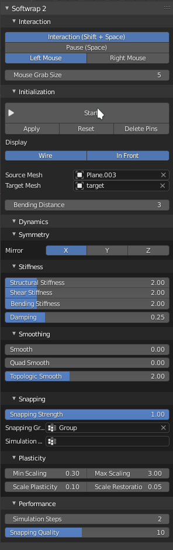
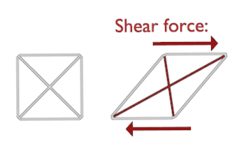

# Interface

Here you find a description of each option in the addon.
Usually you need to tweak them for best results when wrapping complex models.

Or maybe you want a simple [quickstart](tutorials.md).

### Interaction panel

  * **Interaction** enables the mouse interaction with the simulation, when disabled, you cant grab the mesh or create pins.
  * **Pause** Halts the simulation temporarily.
  * **Left Mouse / Right Mouse** which mouse button to use for grabbing the mesh and creating pins
  * **Mouse Grab size** The area of influence when you grab the mesh using the mouse   

### Initialization panel

  * **Start** Starts the simulation as a modal operator, while the simulation is running this button changes to "Stop"
    you can also stop the simulation by pressing ESC

  * **Apply** removes the shapekey created by softwrap and applies its shape as default.
  * **Reset** removes the shapekey but dont apply the shape, essentially reverting the original shapekey
  * **Delete Pins** removes all pins used by the selected source mesh
  * **Bending Distance** the distance in edges for bending springs to be created, the higher this value the less flexible the simulation gets.

### Symmetry panel
  * **Mirror** which axis to mirror the source mesh, the object origin is used as mirror center

### Stiffness panel
  * **Structural Stiffness**
    the Stiffness of the direct links between vertices, the higher the value, the less stretchy the simulation is.

  * **Shear Stiffness**  
    Resistance to a kind of force that distorts polygons known as [Shear](https://en.wikipedia.org/wiki/Shear_stress).
    

  * **Bending Stiffness**   
    Resistance to foces that bend the mesh.

  * **Damping**    
    Dampen the simulation to prevent stability issues, higher values makes the mesh move slower.

### Smoothing panel

  * **Smoothing** Plain smoothing applied the mesh each frame, similar to blender's smooth modifier but dynamic.
  * **Quad Smooth**
    A special kind of smoothing that applies forces to restore the original shape of the quads.
  * **Topologic Smoothing**  
  A smoothing mode that is less aggressive and doesn't shrink the mesh, it uses the edge
   flow as guidance for its smoothing and applies forces to restore the volume.

### Snapping panel
  * **Snapping Force** Applies a force to attract the source mesh to the target mesh.
  * **Snapping group** Vertex group to mask which vertices should be affected by snapping force.
  * **Simulation group** Vertex group to freezes the vertices.

### Plasticity panel.
   * **Max Scaling** maximum allowed plastic deformation scaling for edges.
   * **Min Scaling** minimum allowed plastic deformation scaling for edges.
   * **Scale Plasticity** how much to permanently deform the mesh after its stretched or compressed
   * **Scale Restoration** How much to restore the original length of the edges when its not under stress
### Performance panel
   * **Simulation steps** How many steps to run on each frame, this doesn't affect the movement speed but affects performance and Stiffness.
   * **Snapping Quality** The Quality of the snapping force.
