# Tutorials

These tutorials aim at giving a general introduction to how this addon works but not how you should go about in exact steps, play with it, experiment and use the tool the way you want, not the way somebody told you to use.

with that said there are some aspects of the addon that are useful to keep in mind.    

Since Softwrap uses a heavily modified kind of softbody simulation, its not fully automatic and can misbehave, so sometimes its necessary that you manually define target points on the meshes for better alignment.

!!! note "quick note"
    Just use [Shift+click] to add a pin on the mesh.

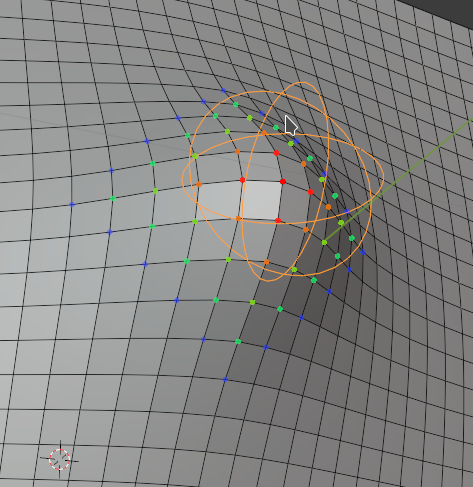{ width=400em}

Those target points borrow the name of "Pins" from other cloth simulation tools and although they work in a similar way, they are not point-like, instead they have a target center location, and a area of influence much like blender's Grab sculpting brush or the Hook modifier.

## Quick start: Topology transference

<H6>In this section you'll get a short introduction to how to use softwrap for a basic topology transfer.</h6>
Maybe you prefer a video.

<iframe frameborder="0" width="100%" height="400" src="https://www.youtube.com/embed/aEH9J-YlwwQ" title="YouTube video player" frameborder="0" allow="accelerometer; autoplay; clipboard-write; encrypted-media; gyroscope; picture-in-picture" allowfullscreen></iframe>

 
<H6>
the following tutorial was made with images extracted from the very video above, so you may read it instead.
</h6>

First we need to clarify what Source and Target meshes are since it tends to be confusing sometimes.    

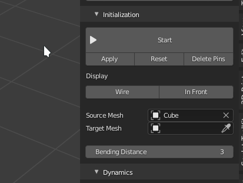

-   **Source mesh** is the mesh that is going to be deformed, its the _source_ of the topology

      Source meshes made of quads are the most common and recommended, either made during a previous manual retopology session or generated by a remesher or obtained from somewhere else such as a basemeshes pack.

      !!! triangles "Triangles?"
          although softwrap do work on triangle based source meshes, most of its features are designed with quad meshes in mind.
          but dont worry about that too much unless you wrap triangle meshes very often.  
          also its okay to have a mixed quad/triangle mesh.

-   **Target mesh** is the final shape desired or _target_ shape

      usually a sculpt or a 3D scan composed of triangles or messy topology though it can be other quad mesh too.

      keep in mind that if your source mesh us a 3D scan it might be useful to do a pre-remeshing on it before using softwrap since 3D scanned meshes usually contain malformed triangles and noisy normals that can confuse the snapping algorithm, voxel-remeshing it will get rid of those issues.    

Okay, lets retopo something now!

you can [download](files/tut1.blend) the file used in the tutorial.

you should have in your file both the sculpt/scan you want to retopo and a basemesh with the topology you want to use.
Those are the ones used in this tutorial.

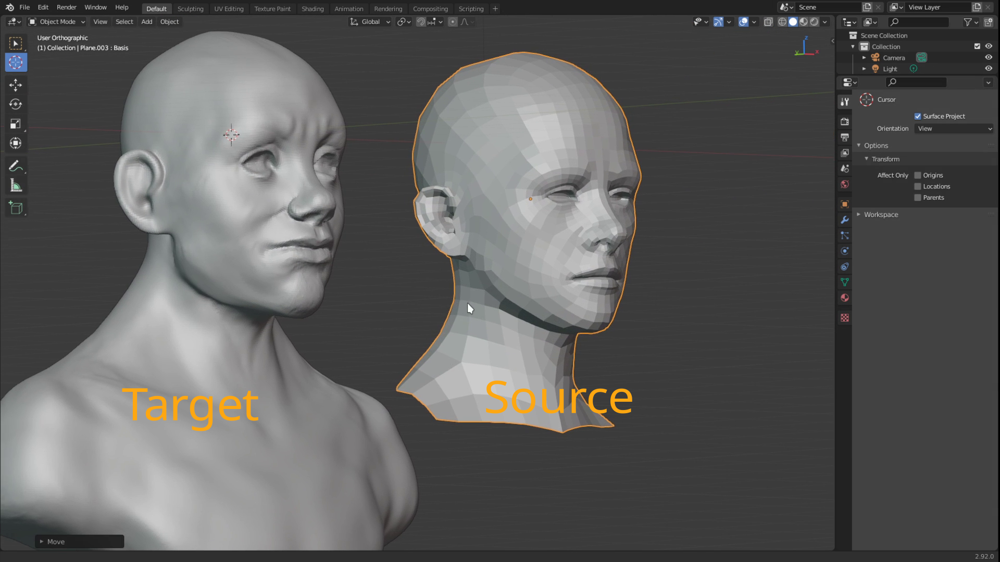

One of the meshes will be our source and the other our target so lets set up that in the initialization panel.

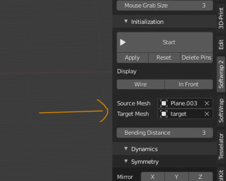

But before we start the simulation, its useful, though not absolutelly necessary to pre-align both models.    

!!! symmetry "important"
    if you are going to use symmetry in the simulation, its extremelly important that both meshes are aligned at least on the symmetry axis.    

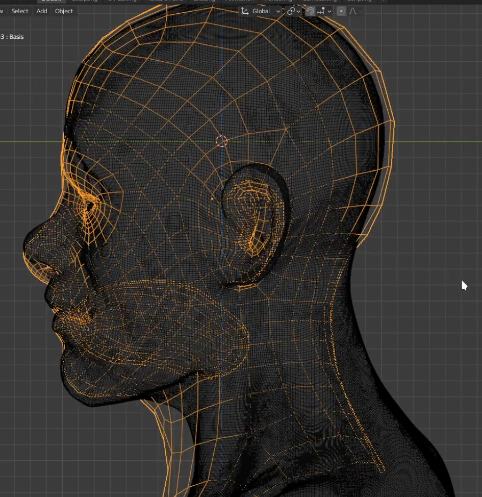

Now just click the Start button to begin the simulation : 

Now the simulation is running but not snapping to anything, it resembles a cloth and you can click and drag with the mouse to manipulate it.  
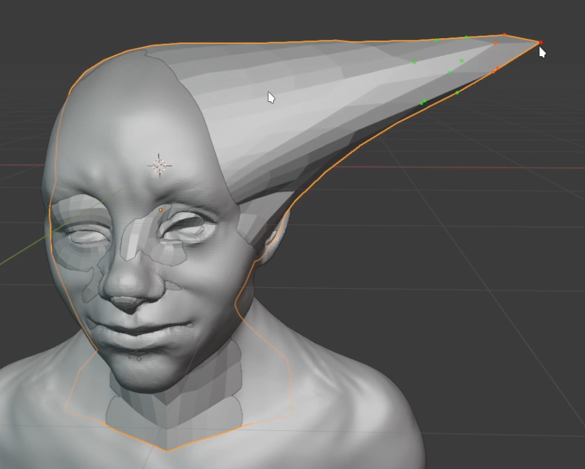

Lets enable X-mirror in the symmetry panel so that both sides are affected in the same way, this allows us to adjust only one side and the other will be mirrored accordingly.  
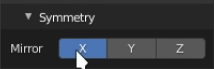

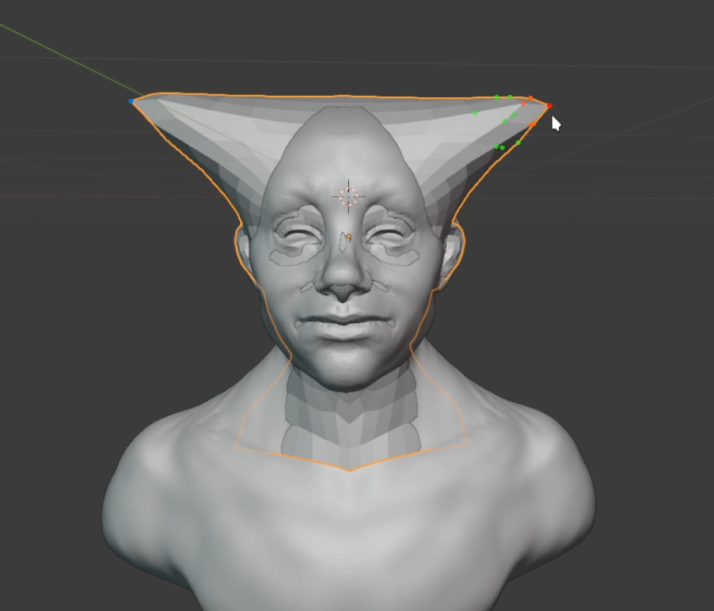

now increase the `Snapping Strength` slider to a high value such as 1.0, this will make the source mesh be "attracted" to the target mesh and stick to its surface.
Much like the shwrinkwrap modifier but dynamically.    

you may also want to enable `In Front` and `Wire` in the initialization panel to see better whats happening with the source mesh.    

But when you do that, you may encounter some weird things happening with the mesh.
Don't worry though, its easy to fix.  
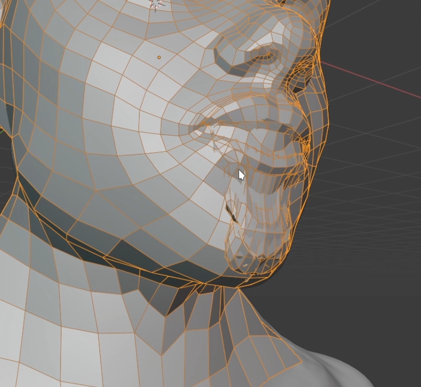

this happens when the mesh has some inward geometry that is not present in the target mesh, usually structures known as mouth-bags that are very common in basemeshes.  
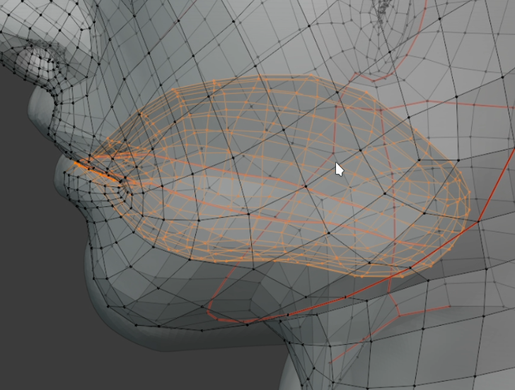

to fix it we must prevent this geometry from snapping to the target mesh since there's no matching structure in it, for that just select and assign all the geometry you don't want to snap to a vertex group
and select this vertex group in the `Snapping Group` drop-down in the snapping panel.  
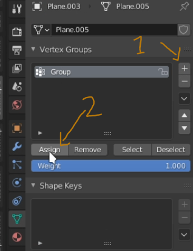 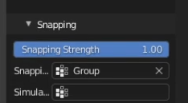

after that, the geometry selected in the vertex group will not snap anymore to anything but will still move dynamically so it can still be adjusted freely.
If you want it to be completely frozen, also select the same vertex group in the `Simulation Group` dropdown.  
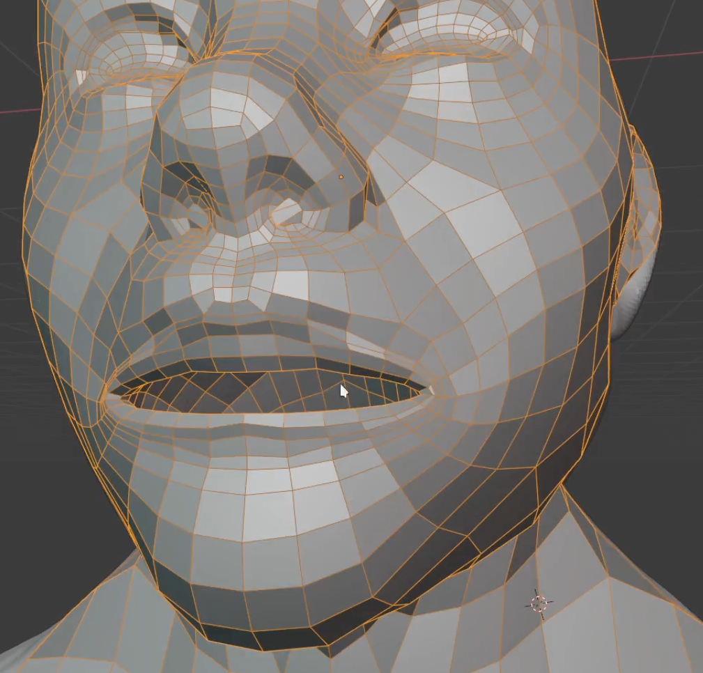

As you may notice, this is still not a very good retopo, it needs to be adjusted.  
Due to the dynamic nature of the simulation, we cant just grab it with the mouse, release and expect it to stay in place forever, fortunately we can add pins!  

By default you can add them with `shift + click`, it creates a empty that locks a region of the mesh in place, by moving the pin with the `G` key you also move the mesh around and
with the `S` key you can adjust the area of influence of the pin.

to make the work easier, Its a good idea to enable blender's face snapping mode, this makes the pin snap to the surface of the target mesh which makes it much easier to position it on the desired place.  
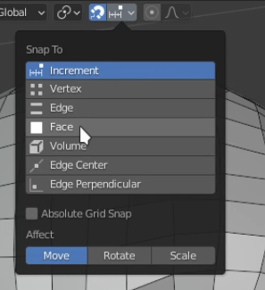
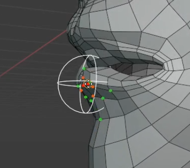

Now its just a matter of adding as many pins as you wish and stop the simulation when you are satisfied with the results.

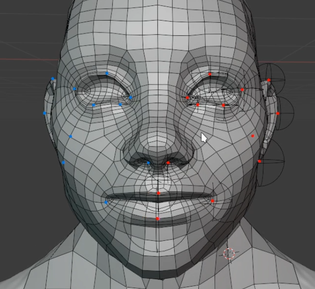

After you are done, you can delete all the pins, and click, apply to make the shape permanent.  
you may also reset the original shape by clicking the `reset` button.

also as a side note, SoftWrap creates a shape key so you may use it to morph the mesh between the original shape and the new shape.  
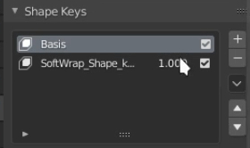
