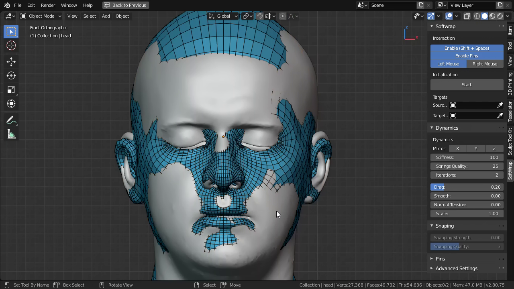
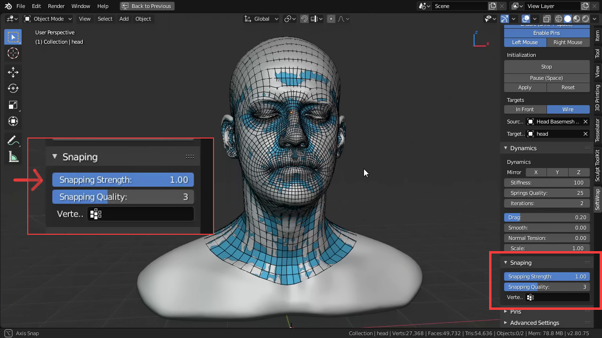
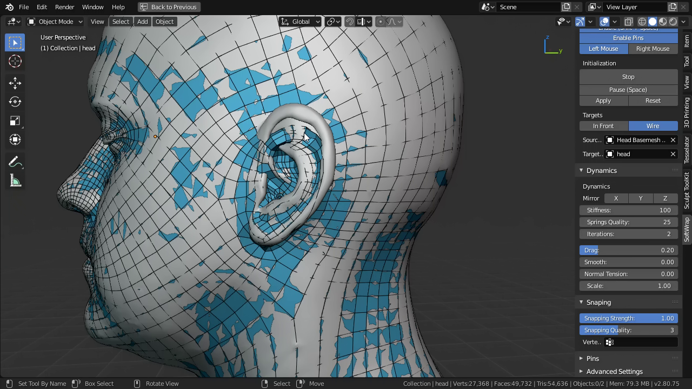

# Tutorials

These tutorials aim at giving a general introduction to how this addon works but not how you should go about in exact steps, play with it like a toy and use the tool the way you want, not the way somebody told you to use (**Unless it's a dangerous tool like a drill, in this case be careful**).

# Getting started: head topology transference

Todo.

[Back to manual contents](#manual-contents)

# Fixing shapes on the fly

Sometimes when the models are not very similar or there's an element that causes problems (often ears), the smapping might not converge to the right place, in those cases, you have to modify the basemesh to fit the target better, this can be done easily in ``sculpt mode``.

You dont need to stop the simulation, SoftWrap automatically pause if you switch to ``sculpt mode`` or ``edit mode`` and any changes to the shape of the basemesh will automatically be taken in account during the simulation after you go back to object mode.

##### As an example we start with a roughly aligned base mesh, this helps with debuging shape discrepancies.

##### After increasing the snapping, the basemesh immediately conforms (Almost).

##### But the ears fail because they are too small.

##### To fix that, we switch to ``sculpt mode`` and change the shape so it's the same size.

